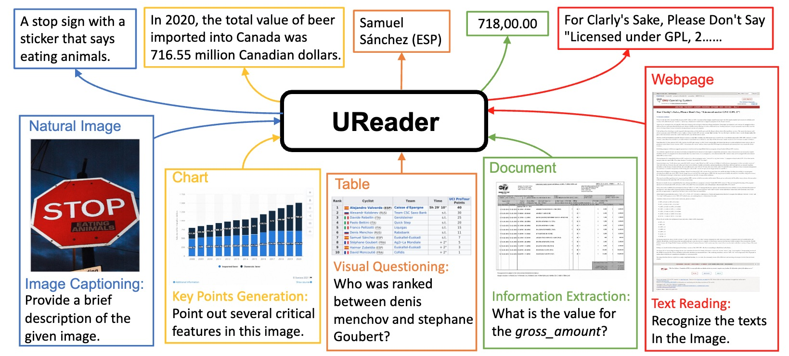

# UReader: Universal OCR-free Visually-situated Language Understanding with Multimodal Large Language Model

<div align="center">

Jiabo Ye*, Anwen Hu*, Haiyang Xu, Qinghao Ye, Ming Yan, Guohai Xu, Chenliang Li, Junfeng Tian, Qi Qian, Ji Zhang, Qin Jin, Liang He, Xin Lin, Fei Huang

*Equal Contribution

</div>
<hr>
<div align="center">
<a href="http://mm-chatgpt.oss-cn-zhangjiakou.aliyuncs.com/mplug_owl_demo/released_checkpoint/UReader_Arxiv.pdf"></a>


</div>

## Training and Inference

Coming soon!

## Instruction-tuning dataset
Download the jsonl files and images from [Mizukiluke/ureader-instruction-1.0](https://huggingface.co/datasets/Mizukiluke/ureader-instruction-1.0/tree/main).

The jsonl files can be placed in ```ureader_json/```. And the images can be orgnized in such format:
```
ureader_images
├── ChartQA
├── DUE_Benchmark
│   ├── DeepForm
│   ├── DocVQA
│   ├── InfographicsVQA
│   ├── KleisterCharity
│   ├── TabFact
│   └── WikiTableQuestions
├── TextCaps
├── TextVQA
└── VisualMRC
```


## Citation
If you found this work useful, consider giving this repository a star and citing our paper as followed:
```
@misc{ye2023ureader,
      title={UReader: Universal OCR-free Visually-situated Language Understanding with Multimodal Large Language Model}, 
      author={Jiabo Ye and Anwen Hu and Haiyang Xu and Qinghao Ye and Ming Yan and Guohai Xu and Chenliang Li and Junfeng Tian and Qi Qian and Ji Zhang and Qin Jin and Liang He and Xin Alex Lin and Fei Huang},
      year={2023},
      eprint={2310.05126},
      archivePrefix={arXiv},
      primaryClass={cs.CV}
}
```